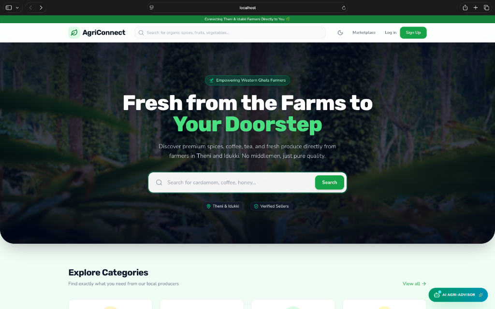
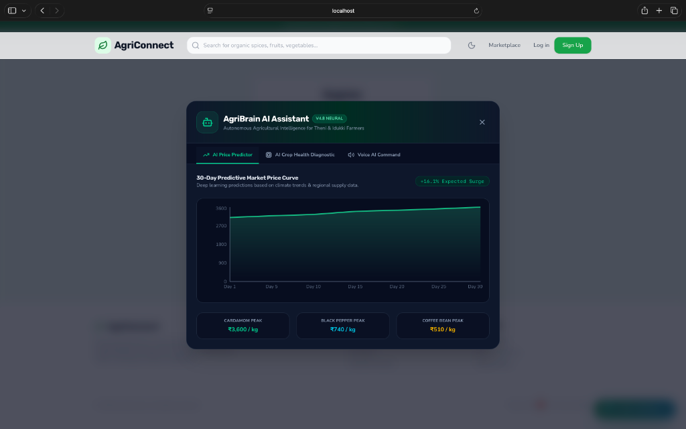
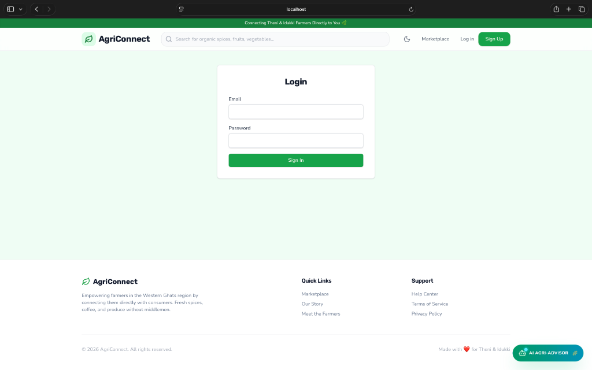
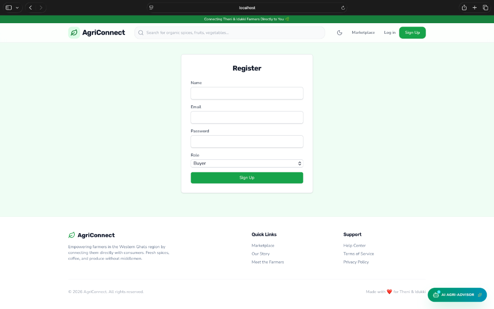

# 🌿 AgriConnect: Direct Farm-to-Consumer Agricultural Exchange

[](https://react.dev/)
[](https://vitejs.dev/)
[](https://nodejs.org/)
[](https://expressjs.com/)
[](https://www.mongodb.com/cloud/atlas)
[](https://redux-toolkit.js.org/)
[](https://tailwindcss.com/)
[](LICENSE)

An enterprise-grade, direct-to-consumer agricultural exchange web platform built for farmers in the Western Ghats region (**Theni & Idukki**). AgriConnect eliminates intermediate broker commissions, provides predictive AI commodity forecasting, and enforces transparent soil-to-table traceability.

---

## 📸 Product Showcases & UI Architecture

### 1. High-Performance Glassmorphism Landing Page
Featuring a custom hero section with lush plantation photography, real-time product search, and responsive regional category navigation.



---

### 2. AgriBrain™ Autonomous AI Assistant
Integrated neural predictive engine powered by Recharts offering 30-day commodity price forecasting (Cardamom, Black Pepper, Coffee), AI crop disease diagnostic tools, and multi-lingual voice command support (Tamil, Malayalam, English).



---

### 3. Identity & Secure Authentication Suite
Production-ready JWT authentication pipeline with Role-Based Access Control (RBAC) supporting Buyers, Vendors/Farmers, and Administrators.

<div align="center">
  
  
</div>

---

## 🏗️ System Architecture & Technology Stack

```mermaid
graph TD
    Client[React 19 + Vite Single Page App] -->|State Management| Redux[Redux Toolkit + Auth Slice]
    Client -->|Global Styling & Theme| Theme[ThemeContext - Persistent Dark/Light Engine]
    Client -->|HTTP REST Requests| API Gateway[Node.js + Express 5 Server]

    subgraph Backend Services
        API Gateway -->|Security Middleware| Sec[Helmet + CORS + JWT Guard]
        API Gateway -->|Route Handlers| Controllers[Product, User, Order & Auth Controllers]
        Controllers -->|ORM & Validation| Mongo[Mongoose 9 ODM]
    end

    subgraph Data Tier
        Mongo -->|TLS Encrypted Connection| Atlas[(MongoDB Atlas Cloud Replica Set)]
    end
```

### Stack Technical Breakdown

| Layer | Technologies & Libraries | Architectural Highlights |
| :--- | :--- | :--- |
| **Frontend UI** | React 19, Vite 8, Tailwind CSS v4, Lucide Icons, Framer Motion | Component-driven atomic design, glassmorphic UI, responsive layouts, 60fps animations. |
| **State & Router** | Redux Toolkit, React Router v7 | Centralized auth slice, dynamic RBAC route guards (`CustomerRoute`, `VendorRoute`, `AdminRoute`). |
| **Backend API** | Node.js v22, Express v5 (ES Modules) | Asynchronous middleware chain, standardized JSON response handlers, centralized error boundaries. |
| **Database** | MongoDB Atlas, Mongoose ODM | Schema validation, indexes for geo/keyword queries, automated timestamping (`createdAt`, `updatedAt`). |
| **Security & Auth** | JSON Web Tokens (HS256), Bcrypt.js, Helmet | Password hashing with salt rounds (10), XSS protection, HTTP header hardening, JWT expiration policies. |

---

## ✨ Key Platform Features

- 🌿 **Direct Farm-to-Table Marketplace**: Direct listings from Cardamom estates in Nedumkandam, Pepper farms in Bodinayakanur, and Tea gardens in Munnar.
- 🌙 **Adaptive Theme Engine**: Seamless global Dark & Light mode toggle with persistent user choice saved to `localStorage` and system media query sync.
- 📈 **AgriBrain AI Price Predictor**: Interactive 30-day price forecasting charts utilizing regional climate indices and historical market pricing trends.
- 🔐 **Role-Based Access Control (RBAC)**:
  - **Buyer / Customer**: Browse products, manage cart, place orders, view order history.
  - **Vendor / Farmer**: Product management studio, listing creation, sales dashboard analytics.
  - **Admin**: Platform oversight, user role verification, catalog moderation.
- 📜 **Blockchain Traceability Ledger**: Soil-to-table batch certificate verification for chemical residue testing and organic origin audits.

---

## 📁 Repository Directory Structure

```
AgriApp/
├── client/                     # Vite + React Frontend Application
│   ├── public/                 # Static assets, logos, and high-res images
│   │   └── images/             # Product photography & Hero background assets
│   ├── src/
│   │   ├── components/         # Reusable UI components (Navbar, Modals, Route Guards)
│   │   ├── context/            # React Context Providers (ThemeContext)
│   │   ├── layouts/            # Page layouts (MainLayout with dynamic outlets)
│   │   ├── pages/              # View pages (Home, Products, Login, Register, Dashboards)
│   │   ├── store/              # Redux Toolkit store and feature slices
│   │   ├── index.css           # Tailwind v4 configuration & theme tokens
│   │   └── App.jsx             # React Router v7 routes setup
│   └── package.json
│
├── server/                     # Node.js + Express REST API Backend
│   ├── config/                 # Database connection config (db.js)
│   ├── controllers/            # Controller business logic (auth, product, order)
│   ├── middlewares/            # Auth guards, error handlers, request validators
│   ├── models/                 # Mongoose schemas (User, Product, Order)
│   ├── routes/                 # Express API routing tables
│   ├── scripts/                # Utility scripts & automated asset tools
│   ├── seeder.js               # Database population script with realistic test data
│   ├── server.js               # Express application entry point
│   └── package.json
│
└── docs/
    └── images/                 # Screenshot assets for technical documentation
```

---

## ⚡ Quick Start & Development Setup

### Prerequisites
- **Node.js**: `v22.18.0` or higher
- **npm**: `v10.0.0` or higher
- **MongoDB**: Access to a MongoDB Atlas cluster or local MongoDB instance

### 1. Environment Configuration

Create a `.env` file inside the `server/` directory:

```env
PORT=5000
NODE_ENV=development
MONGO_URI=mongodb+srv://<user>:<password>@cluster.mongodb.net/agri-app?retryWrites=true&w=majority
JWT_SECRET=your_super_secret_jwt_key_here_32_bytes_min
JWT_EXPIRES_IN=30d
```

### 2. Install Dependencies

```bash
# Install backend dependencies
cd server
npm install

# Install frontend dependencies
cd ../client
npm install
```

### 3. Seed Database (Optional)

To populate MongoDB Atlas with initial organic spice and produce listings:

```bash
cd server
node seeder.js
```

### 4. Running Development Servers

Start the API Backend Server:
```bash
cd server
npm run dev
```
*Backend runs on `http://localhost:5000`*

Start the Frontend Vite Client (in a separate terminal):
```bash
cd client
node node_modules/vite/bin/vite.js
# Or using npm:
# npm run dev
```
*Frontend runs on `http://localhost:5173/`*

---

## 🔒 Security & Code Quality Standards

1. **Password Security**: Passwords are salted and hashed using `bcryptjs` with 10 salt rounds prior to persistence.
2. **Token Lifecycle**: JWT tokens signed with HS256 algorithm and validated on protected backend API endpoints via middleware guards.
3. **Response Hardening**: Sensitive attributes (e.g. `password`) excluded from queries using Mongoose `.select('-password')`.
4. **HTTP Header Protection**: Enforced via `helmet` middleware against cross-site scripting (XSS), clickjacking, and MIME-sniffing.
5. **Code Style**: Modular ES module imports (`type: "module"`), clean code separation, and self-documenting code style.

---

## 📝 License

Distributed under the **MIT License**. See `LICENSE` for more information.

---

<div align="center">
  <sub>Built with ❤️ for the agricultural community of Theni & Idukki</sub>
</div>
